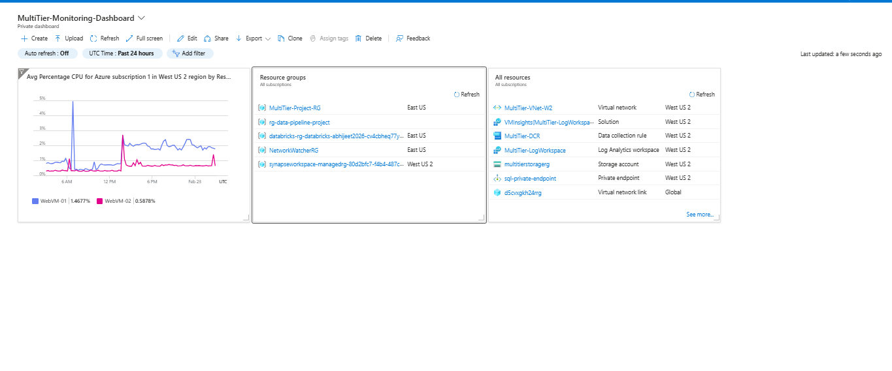

# 🚀 Multi-Tier Azure Infrastructure Project


> A production-grade Multi-Tier Architecture deployed on Microsoft Azure with full monitoring, alerting, and observability — built completely hands-on.

---

## 📌 Project Overview

This project demonstrates the design and deployment of a **scalable, secure, and monitored Multi-Tier Web Application Infrastructure** on Microsoft Azure. Every component was configured manually through the Azure Portal — no shortcuts, no templates.

---

## 🏗️ Architecture Diagram

```
                        ┌─────────────────────────────────┐
                        │         INTERNET USERS          │
                        └────────────────┬────────────────┘
                                         │
                        ┌────────────────▼────────────────┐
                        │      WebApp-LoadBalancer         │
                        │      (Standard SKU)              │
                        │      West US 2                   │
                        └──────────┬──────────┬───────────┘
                                   │          │
               ┌───────────────────▼──┐  ┌───▼───────────────────┐
               │      WebVM-01        │  │      WebVM-02          │
               │  (Windows Server)    │  │  (Windows Server)      │
               │  Public Subnet       │  │  Public Subnet         │
               └───────────────────┬──┘  └───┬───────────────────┘
                                   │          │
                        ┌──────────▼──────────▼──────────┐
                        │     MultiTier-VNet              │
                        │  ┌─────────────────────────┐   │
                        │  │   Public Subnet          │   │
                        │  │   Private Subnet         │   │
                        │  └─────────────────────────┘   │
                        └─────────────────────────────────┘
                                         │
                        ┌────────────────▼────────────────┐
                        │      Azure Monitor              │
                        │  Log Analytics Workspace        │
                        │  VM Insights | DCR              │
                        │  CPU & Memory Alerts            │
                        └─────────────────────────────────┘
```

---

## ⚙️ Components Built

### 🔷 1. Networking Layer
| Resource | Details |
|----------|---------|
| Virtual Network | MultiTier-VNet |
| Public Subnet | For Web VMs |
| Private Subnet | For Backend resources |
| NSG Rules | HTTP (80), RDP (3389), SSH (22) |
| Location | West US 2 |

### 🖥️ 2. Compute Layer
| Resource | Details |
|----------|---------|
| WebVM-01 | Windows Server — Public Subnet |
| WebVM-02 | Windows Server — Public Subnet |
| Load Balancer | WebApp-LoadBalancer (Standard SKU) |
| Backend Pool | WebVM-01 + WebVM-02 |

### 📊 3. Monitoring & Observability
| Resource | Details |
|----------|---------|
| Log Analytics Workspace | MultiTier-LogWorkspace |
| VM Insights | Enabled on both VMs |
| Data Collection Rule | MultiTier-DCR |
| CPU Alert | Percentage CPU > 80% |
| Memory Alert | Available Memory < 1GB |
| Action Group | AlertActionGroup (Email + SMS) |
| Dashboard | MultiTier-Monitoring-Dashboard |

### 🔒 4. Security
| Resource | Details |
|----------|---------|
| NSG | Applied to Public Subnet |
| Inbound Rules | HTTP, RDP, SSH only |
| Private Subnet | Isolated backend resources |

---

## 📸 Screenshots

### Resource Group Overview


### Virtual Network & Subnets


### Load Balancer


### Alert Rules


### Monitoring Dashboard


---

## 🚀 Step-by-Step Deployment

### Step 1: Create Resource Group
```
Name: MultiTier-Project-RG
Region: West US 2
```

### Step 2: Create Virtual Network
```
Name: MultiTier-VNet
Address Space: 10.0.0.0/16
Public Subnet: 10.0.1.0/24
Private Subnet: 10.0.2.0/24
```

### Step 3: Configure NSG Rules
```
Inbound Rules:
- HTTP  : Port 80  — Allow
- RDP   : Port 3389 — Allow
- SSH   : Port 22  — Allow
```

### Step 4: Deploy Virtual Machines
```
WebVM-01:
- OS: Windows Server
- Subnet: Public Subnet
- NSG: MultiTier-NSG

WebVM-02:
- OS: Windows Server
- Subnet: Public Subnet
- NSG: MultiTier-NSG
```

### Step 5: Create Load Balancer
```
Name: WebApp-LoadBalancer
SKU: Standard
Type: Public
Backend Pool: WebVM-01, WebVM-02
Health Probe: HTTP Port 80
Load Balancing Rule: Port 80 → Port 80
```

### Step 6: Setup Monitoring
```
Log Analytics Workspace: MultiTier-LogWorkspace
VM Insights: Enabled on WebVM-01 & WebVM-02
Data Collection Rule: MultiTier-DCR
```

### Step 7: Create Alert Rules
```
Alert 1 - CPU-High-Alert:
- Signal: Percentage CPU
- Condition: Greater than 80%
- Severity: 2 - Warning

Alert 2 - Memory-High-Alert:
- Signal: Available Memory Bytes
- Condition: Less than 1073741824 (1GB)
- Severity: 2 - Warning

Action Group: AlertActionGroup
- Email notification
- SMS notification
```

### Step 8: Create Dashboard
```
Name: MultiTier-Monitoring-Dashboard
Tiles:
- Metrics Chart (Live CPU for WebVM-01 & WebVM-02)
- Resource Groups
- All Resources
```

---

## 💡 Key Learnings

- How Azure Load Balancer distributes traffic across multiple VMs
- Setting up Azure Monitor alerts for proactive infrastructure management
- Using VM Insights & Log Analytics for deep observability
- Building real-time dashboards for performance visibility
- Designing secure network architecture with NSGs and subnets
- Configuring Data Collection Rules for metric collection

---

## 🛠️ Technologies Used

- Microsoft Azure Portal
- Azure Virtual Network (VNet)
- Azure Virtual Machines (Windows Server)
- Azure Load Balancer (Standard SKU)
- Azure Monitor
- Azure Log Analytics
- Azure VM Insights
- Azure Alerts & Action Groups
- Azure Dashboard

---

## 👨‍💻 Author

**Abhijeet Bhaskar**
- 💼 Technical Support Analyst
- 🏢 ESDS Software Solution Limited
- 📍 Nashik, Maharashtra, India
- 🔗 [LinkedIn](https://www.linkedin.com/in/abhijeetbhaskar)
- 📧 abhijeetbhaskar53@gmail.com

---

## 📄 License

This project is licensed under the MIT License — feel free to use it for learning and reference!

---

## 🔜 Next Projects

- [ ] Azure Kubernetes Service (AKS)
- [ ] CI/CD Pipeline with Azure DevOps
- [ ] Azure SQL + App Service Web Application
- [ ] Azure Databricks Data Pipeline

---

⭐ **If this project helped you, please give it a star!** ⭐
